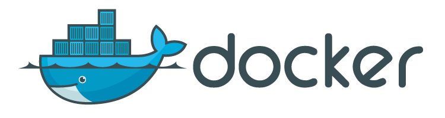

<p align="center">

## Instalación
### Descarga Docker
Descargar e instalar docker

https://download.docker.com/linux/

`# dpkg -i package_file.deb`

## Imágenes Docker
https://hub.docker.com/explore/

Al hablar de imágenes en Docker, nos referimos a las plantillas que utilizamos para crear los contenedores. Pueden llevar desde un simple ejecutable hasta un sistema operativo completo lleno de dependencias.

## Contenedores Docker
Los contenedores son nuestras máquinas ya construidas, a partir de una imagen, y que usamos para ejecutar nuestras aplicaciones en un ordenador o servidor. Una de las particularidades que veremos de los contenedores es que se separan en capas, esto es, que cada una de las modificaciones que se producen desde la imagen, se van almacenando separadamente.

### Algunos comandos
`$ docker pull debian` instalar una imagen

`$ docker ps -a` lista los contenedores

`$ docker images` lista las imagenes


`$ docker history debian_container` ver el historial de capas de un contenedor

`$  docker run debian` corre un contenedor en base a una imagen

`$ docker run -ti debian` corre un contenedor en terminal e interactivo

`$ docker run -ti --rm debian` corre un contenedor interactivo que al finalizar sera eliminado

`$ docker run -d debian` corre un contenedor en daemon

`$ docker run -d --name debian_container debian` contenedor en daemon con nombre

`$ docker rm id` elimina el contenedor parado en base a su ID

`$ docker stop id` para el contenedor activo en base a su ID

`$ docker rmi id` elimina la imagen en base a su ID

`$ docker run -ti –rm -p2222:80 debian_container:nginx` redireccióna el puerto local 2222 al 80 del contenedor


## Dockerfile
La unidad mínima que necesitamos para construir una imagen Docker es un Dockerfile. Un Dockerfile no es otra cosa que un fichero de texto en el que se encuentra la definición de cómo Docker tiene que crear y construir esta imagen.

```bash
FROM debian:9
LABEL version="1.0" name=you@example.com
RUN 	apt-get update\ &&
		apt-get install -y\
			nginx\
			php\ &&
		rm -rf /var/lib/apt/list/*
ADD public/archivo.txt /root/archivo.txt
ENV var1=”valor1” var2=”valor2”
EXPOSE 80
CMD [“uname”, “-a”]
```
* "FROM" indica en que imagen se basar el nuevo contenedor

* "LABEL" agrega metadatos a una imagen

* "RUN" ejecuta comandos en el nuevo contenedor
	* "\" agrega un salto de linea para una mayor legibilidad del archivo

	* "&&" concatena instrucciones

* "ADD" agrega un archivo al nuevo contenedor

* "ENV" agrega variables de entorno

* "EXPOSE" define el puerto de red para escuchar

* "CMD" comando que se ejecuta por defecto

`$ docker build -t debian:nginx` construlle una imagen con el nombre “debian” y el tag “nginx”

## Storage Driver
Docker ofrece una tabla de los "driver" de almacenamiento que están disponibles. Dependiendo del "kernel", la versión del sistema operativo, el tipo de herramientas que se estan usando, los discos que esten disponibles, se puede usar unos u otros. De hecho, Docker tiene una tabla que indica cuáles "drivers" son más adecuados según para cada objetivo que se tenga.

`$ docker info` proporciona la informacion de docker

`$ uname -a` proporciona la vercion del kernel del sistema operativo

`aufs` es ideal para kernel v3

`overlay2` es ideal para  kernel v4

## Redes
Cuando el proceso de Docker nace, configura una nueva interfaz puente virtual llamada docker0 en el sistema host. Esta interface permite a Docker crear una sub-red virtual para el uso de los contenedores que se ejecutarán. Este puente funciona como el punto o interfaz principal entre la creación de redes en el contenedor y el host.

* "bridge" puente entre la red de el contenedor y la red virtual  “docker0”

* "host" copia la configuración del host

* "none" elimina la configuración de red

`$ docker network ls` lista las redes

`$ docker network create --driver bridge red1` crea una nueva red

`$ docker network inspect bridge` ver en detalle que parametros tiene cada red

`$ docker run --net=red1 --name debian_container debian` arrancar un contenedor en la nueva red