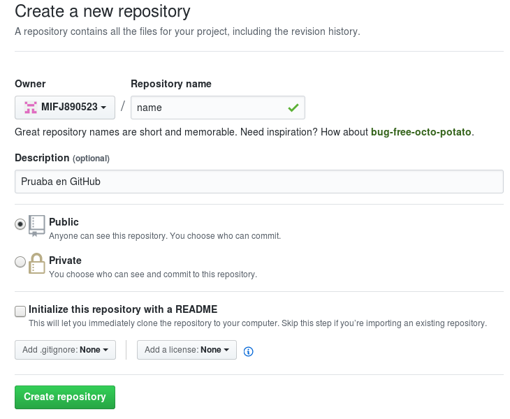

## Instalación
### Instala Git
`# apt-get install git`
### Revisa si Git se instaló correctamente
`$  git --version`
### Agregar identidad
Lo primero que deberías hacer cuando instalas Git es establecer tu nombre de usuario y dirección de correo electrónico. Esto es importante porque las confirmaciones de cambios (commits) en Git usan esta información, y es introducida de manera inmutable en los commits que envías:

`$ git config --global user.name "Alejandro Miranda"`

`$ git config --global user.email "acidexperience@gmail.com"`

## Crea un repositorio
https://github.com/new

* En esta página, en la caja Nombre del Repositorio, digita el nombre para tu repositorio de código.

* También llena una descripción para decir lo que tu repositorio va a contener. Tu pantalla debe mostrar algo como esto:

## Subir proyecto
* Después de tener el repositorio en nuestra cuenta, selecciona la dirección del repositorio "SSH o HTTP" y clonar

	`$ git clone https://github.com/MIFJ890523/name.git`

* Este comando muestra la lista de los archivos que se han cambiado junto con los archivos que están por ser añadidos o comprometidos

	`$ git status` ó `$ git status`

* Agregar archivos al index

	`$ git add .`

* El comando commit es usado para cambiar a la cabecera. Ten en cuenta que cualquier cambio comprometido no afectara al repertorio remoto

	`$ git commit -am "Commit de prueba"`

* Un simple push envía los cambios que se han hecho en la rama principal de los repertorios remotos que están asociados con el directorio que está trabajando

	`$ git push`